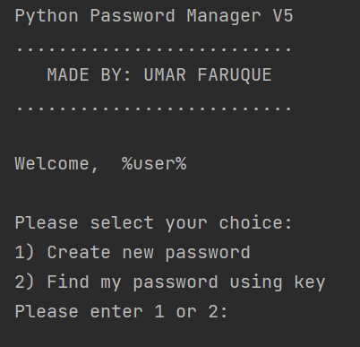
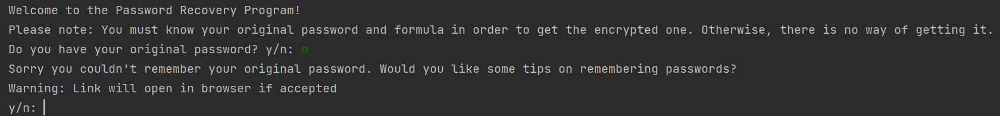
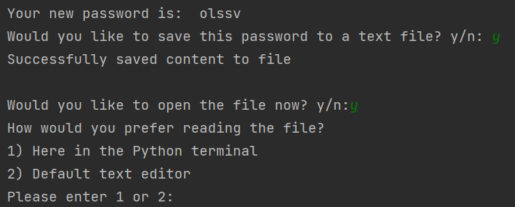

Here is a link to the Replit: [Click here](https://replit.com/@umarhunter/pythonpasswordencrypter?v=1)

     
   
   

Objective: Create a Python program that allows users to encrypt their own passwords. The program also features a Password Recovery function and pre-set values to select. The program also saves sensitive information on a text file and allows accessibility to said file.

**CURRENT STABLE VERSION: 5**

Supports: 
- add confirmation for password inputs
- simplify code as much as possible for public release

**UPCOMING BUILD VERSION: none**

**FORMER VERSIONS:**

Version 1: 
- allowed user input 
- contained necessary functions for future implementation seen in version 2

Version 2:
- pre-determined formulas
- optional debug statements if necessary
- randomized number of transformation depending on formula
- checks if inputs are correct
- prints out new password to console

Version 3:
- storing password in text file
- saves the key to text file
- retrieves encrypted password

Version 4:
- fully implemented user formula functionality
- fixed ZZZ error
- rename variables for public release
- open password txt file via path